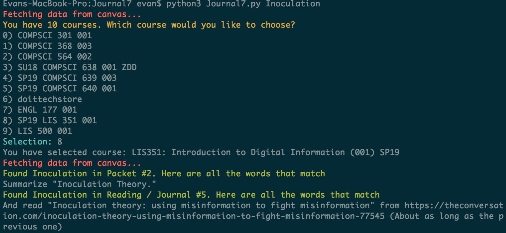

# Journal7
### URL
The URL for the source code of this project is available here: https://github.com/ekivolowitz/LIS351Projects/tree/master/Journal7 
### Assignment Writeup
#### Intentions
Someone asked me what week we talked about `foo`. I didn't have an answer, but I thought that'd be an easy thing to enumerate with python.
#### Input Work Done
I had to explore with the API to find the assignments lists, which I did in the console in the browser. Then I modified the path and found the data that I wanted. 
#### Output Results
This worked really well - here is an example of the input and output. 


#### Approach
To do this, I really just needed to see where the data was. To do that, all I needed 
was to explore the API on the browser. 
#### Thoughts on the results
I'm happy with it. It will 100% make the packets easier...
### Dependencies
* [python3](https://www.python.org/download/releases/3.0/)
* [argparse](https://docs.python.org/3/library/argparse.html)
* [termcolor](https://pypi.org/project/termcolor/)
* [BeautifulSoup](https://www.crummy.com/software/BeautifulSoup/bs4/doc/)

### Usage

```bash
$ python3 Journal7.py search_term
```
### References
None
