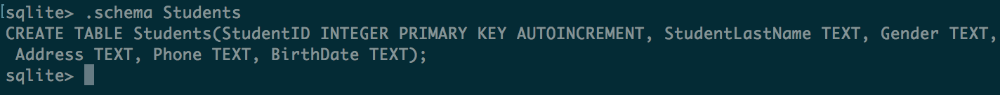
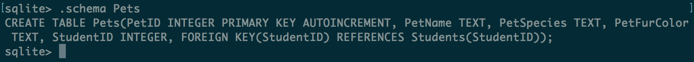
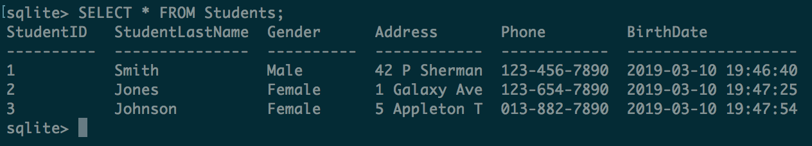
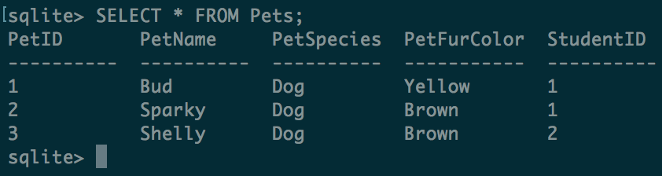

# Packet 2
## Part 1
1. Inoculation Theory is the theory that if you introduce someone to something in a weak form, they'll learn how to fight it when they encounter stronger forms. For example, if you show someone an article that is clearly full of fake information, the reader will be more crtiical of the information.
2. Recognition and Fluency are antonyms of each other. Recognition states that "we tend to believe things we cannot remember seeing before are less important." While Fluency states that "we tend to believe things that are easy to remember are more important." In short, the contrast is if we don't remember it, it's less important than things we do remember.
3. We use databases to record data for several reasons. It is easier to encode semantic meaning into tables with relationships, primary keys, and foreign keys than it is with spreadsheets. It's easier to query said data and for more expressive and powerful to query using a database. And finally, databases are designed to be accessed programatically, which makes it easier for web applications to fetch data from them to build more interactive user experiences.
4. `Primary Key` is a unique identifier of an entry into a database table, while a `Foreign Key` is a secondary identifier of the primary key object in another table. A junction table is the result of joining two tables together, mapping primary keys to foreign keys to concatenate data correctly.
## Part 2
1. Students Table

2.

3.

4.

5.
Refer to number 2. The schema of the `Pets` table enforces the foreign key relationship.
 
