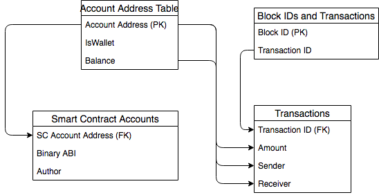

# Packet 2
## Part 1
1. Inoculation Theory is the theory that if you introduce someone to something in a weak form, they'll learn how to fight it when they encounter stronger forms. For example, if you show someone an article that is clearly full of fake information, the reader will be more crtiical of the information.
2. Recognition and Fluency are antonyms of each other. Recognition states that "we tend to believe things we cannot remember seeing before are less important." While Fluency states that "we tend to believe things that are easy to remember are more important." In short, the contrast is if we don't remember it, it's less important than things we do remember.
3. We use databases to record data for several reasons. It is easier to encode semantic meaning into tables with relationships, primary keys, and foreign keys than it is with spreadsheets. It's easier to query said data and for more expressive and powerful to query using a database. And finally, databases are designed to be accessed programatically, which makes it easier for web applications to fetch data from them to build more interactive user experiences.
4. `Primary Key` is a unique identifier of an entry into a database table, while a `Foreign Key` is a secondary identifier of the primary key object in another table. A junction table is the result of joining two tables together, mapping primary keys to foreign keys to concatenate data correctly.
## Part 2
1. Students Table

2.

3.

4.

5.
Refer to number 2. The schema of the `Pets` table enforces the foreign key relationship.
 
## Part 3
Unfortunately I couldn't make it to class that week, so I did the activity on my own. Here is one of the complex data type tables for my noun, school. I used the Departments table

Creating schemas is a difficult task. There is no right or wrong way to do anything, but there are better and worse ways to do it. For this course, we are using Relational Databases, but how would our projects change if we were to use a NoSQL solution? While it would probably be easier for us to create individual datapoints in our tables with NoSQL, what would we be trading off? The rigidity of Relation Databases is sometimes annoying, but it feels like a necessary evil. If you want your DB to be maintainable, to be performant, and usable, the rigidity, while annoying at times, is what allows for that. 

Looking back, I would like to try mapping out my several tables into a document based solution in MongoDB. I think that it would've been easier to use for this project, but if we were to apply this project at scale, more difficult.

## Part 4
I found it interesting that the majority of people opted not to use online tools to make the diagrams, rather they opted to hand draw them and then upload a picture. Seven out of the ten responses I viewed drew them by hand. I was surprised about the layout and design of the tables. The majority of the tables follow a very similar design, one parent table with two child tables composing of fields. This makes me wonder if that's the best way of diagramming each set of interactions, or if it is the most obvious way of diagramming it. 

## Part 5
1. I would like to research Ethereum.
2. I would like to track the cost of Ethereum in USD and transaction data in recent blocks.
3. One address can be a part of many transcations. A transaction can have many payers and many payees. 
4. One smart contract can be tied to one address.
5. Tables:

|Transaction ID|Sender|Receiver|Amount|
|--------------|------|--------|------|

|Block ID|Transaction ID|
|--------|--------------|

|Account Address|IsWallet|Balance|
|--|--|--|

|Smart Contract Account Address|Binary ABI|Author|
|---|---|---|

6. Here is a representation of the tables

7.
<<<<<<< HEAD

=======

>>>>>>> 3c9fbc9256ad98a7ec88e79fce19729910ac7586
